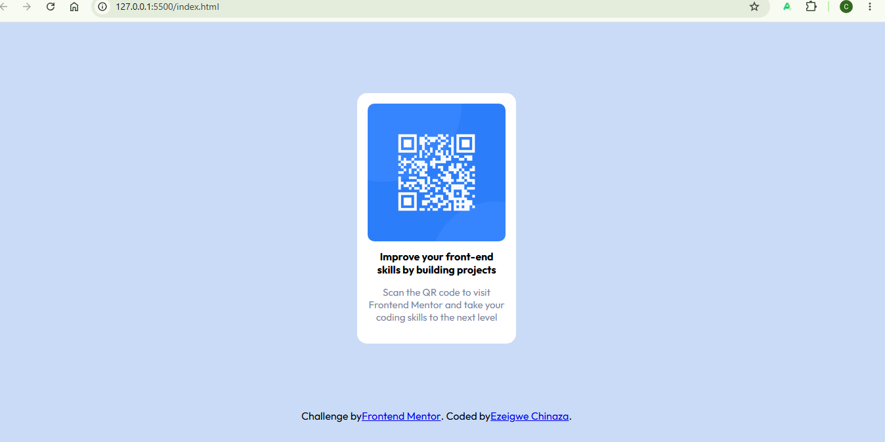

# Frontend Mentor - QR code component solution

This is a solution to the [QR code component challenge on Frontend Mentor](https://www.frontendmentor.io/challenges/qr-code-component-iux_sIO_H). Frontend Mentor challenges help you improve your coding skills by building realistic projects. 

## Table of contents

- [Overview](#overview)
  - [Screenshot](#screenshot)
  - [Links](#links)
- [My process](#my-process)
  - [Built with](#built-with)
  - [What I learned](#what-i-learned)
  - [Continued development](#continued-development)
  - [Useful resources](#useful-resources)
- [Author](#author)

## Overview

### Screenshot

### Links

- Solution URL: [Add solution URL here](https://github.com/Butter77fly/Frontend-Mentor-QR-Card)
- Live Site URL: [Add live site URL here](https://butter77fly.github.io/Frontend-Mentor-QR-Card/)

## My process

### Built with

- Semantic HTML5 markup
- CSS3
- Flexbox
- Google Fonts (Outfit)

### What I learned

While building this project, I improved my understanding of Flexbox and how elements are positioned on a webpage. One challenge I worked through was positioning the footer correctly and understanding how the normal document flow affects its placement.

I also gained more confidence in styling components from a design reference. By recreating the QR code card, I practiced working with spacing, border radii, typography, colors, and image sizing to closely match the provided design.

One piece of CSS I'm particularly proud of is the styling for the card component:
.contents p{
    color:#7b879d;
    font-size: 15px;
    text-align: center;
}

### Continued development

In future projects, I want to continue improving my understanding of Flexbox and responsive design. While working on this project, I became more comfortable positioning elements and recreating layouts from a design, but I would like to gain more experience building interfaces that adapt seamlessly to different screen sizes.

### Useful resources

* [MDN Web Docs](https://developer.mozilla.org/) - MDN was an excellent reference for HTML and CSS concepts. I frequently used it to check property syntax and understand how different CSS rules work.

* [CSS-Tricks Flexbox Guide](https://css-tricks.com/snippets/css/a-guide-to-flexbox/) - This guide helped me better understand Flexbox and how to align and position elements on a page. I plan to continue using it as I learn more advanced layouts.

* [Google Fonts](https://fonts.google.com/) - I used Google Fonts to import the Outfit font used in the design. It was simple to implement and improved the overall appearance of the project.

## Author

- Website - [Ezeigwe Chinaza](https://github.com/Butter77fly)
- Frontend Mentor - [@Butter77fly](https://www.frontendmentor.io/profile/Butter77fly)
